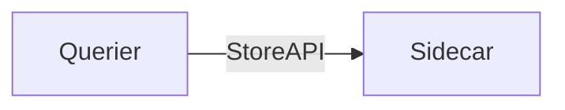
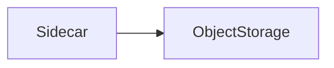
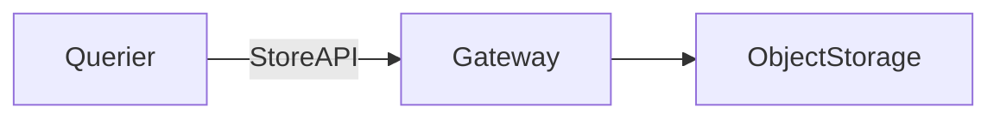

Prometheus + Thanos によるリモートストレージの検証の為のローカル環境構築事例です。

## Docker 起動

```
$ docker-compose up -d
```

## 起動されるコンテナ

| コンテナ | 説明 | URL |
|---|---|---|
| prometheus | Prometheus Server (labels: cluster=kenzo, replica=r1) | http://localhost:9081/ |
| thanos-sidecar | Thanos Sidecar for Prometheus Server | ブラウザ経由でアクセス不可 |
| thanos-querier | Thanos Query Gateway | http://localhost:10902 |
| thanos-ruler | Thanos Ruler | http://localhost:10903 |
| thanos-store-gateway | Thanos Store Gateway | not accessible via browser |
| thanos-compactor | Thanos Compactor | ブラウザ経由でアクセス不可 |
| minio | Minio - Amazon S3 Compatible Object Storage | http://localhost:9000 |
| alertmanager | Alertmanager | http://localhost:9093/ |
| cadvisor | cAdvisor | http://localhost:8080 |
| node-exporter | Node Exporter | http://localhost:9100/ |

## minio の credentials

Access Key - kenzo0107
Secret Key - tanoshiiThanos (Keys are stored in the `docker-compose.yaml` file)

## Thanos 各コンポーネントの役割


各コンポーネントの役割を見る上で Thanos 提供のコンポーネントのダイアグラムを見ると理解が深まります。

### SideCar (thanos-sidecar)

* Sidecar は StoreAPI を介して Prometheus のデータを Querier に提供するプロキシとして動作



* ディスクからPrometheusのデータをオブジェクトストレージにアップロードして永続化させる



## Store Gateway (thanos-store-gateway)

* Querier が Store Gateway の StoreAPI を介してオブジェクトストレージのデータを取得



## [Compactor](https://thanos.io/components/compact.md/)

* オブジェクトストレージをスキャンし古いデータを圧縮し、クエリ効率を向上
* ダウンサンプリングされたデータのコピーを作成してクエリを高速化

## [Ruler](https://thanos.io/components/rule.md/) (thanos-ruler)

* Querier に対して Alert ルールを設定
  * Querier が参照する複数の Prometheus にまたがった監視が可能
  * Prometheus 単体がの保存期間を超えたルールで監視が可能
